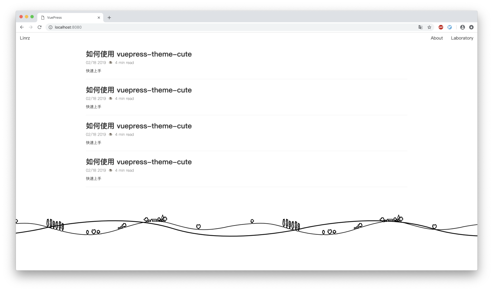
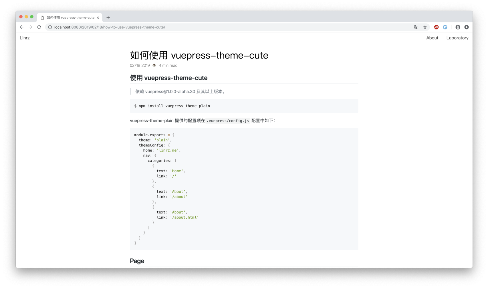

# vuepress-theme-plain
> A cute for vuepress.

## Usage
```shell
$ npm install vuepress-theme-cute
```

## Introdoction



## Author
**vuepress-theme-cute** © [linrz](https://github.com/linrz), Released under the [MIT](./LICENSE) License.<br>
Authored and maintained by linrz.

> [github.com/linrz](https://github.com/linrz) · GitHub [@linrz](https://github.com/linrz) · Twitter [@linrzPro](https://twitter.com/linrzPro)

<br>

2019 © [linrz](https://github.com/linrz)